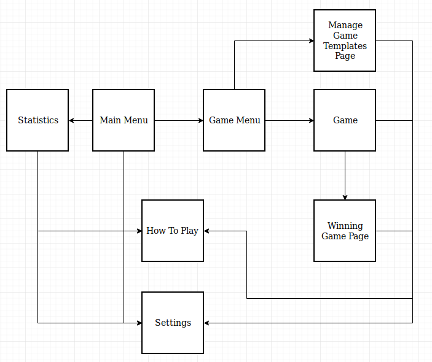
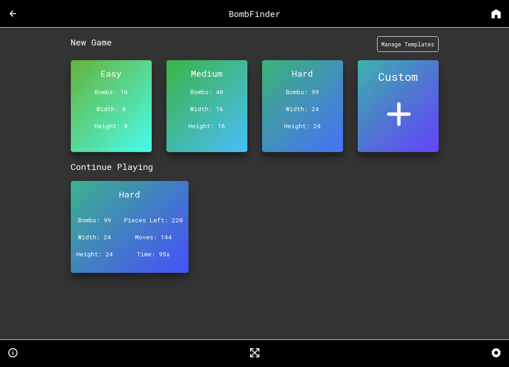
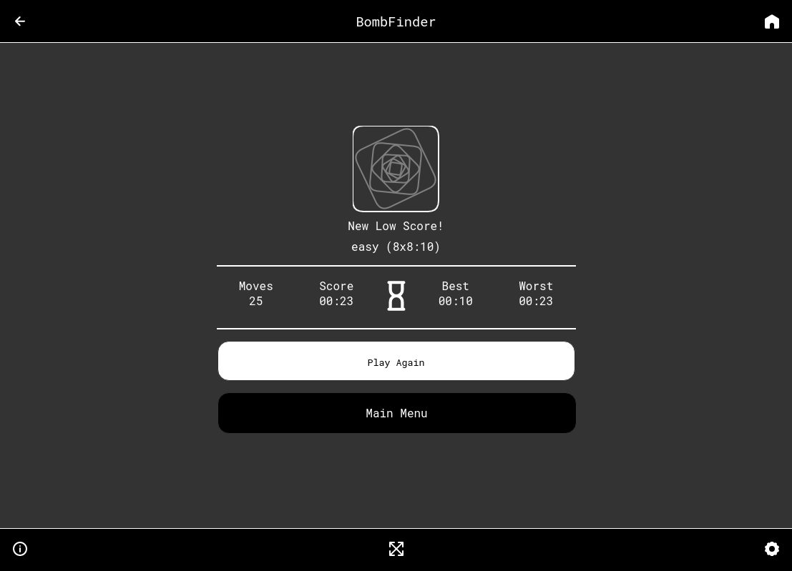
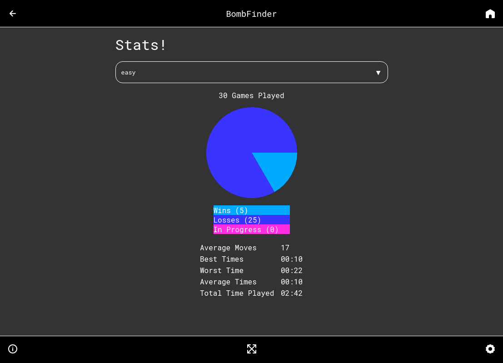

## Overview
I decided to re-make minesweeper from the ground up, as well as build upon by it
adding features like game templates, game statistics and settings. My main 
inspiration for the project was to mimic a Google's Research lab project they 
called proxx.app.

## Goals
The goal was to remake minesweeper and create a PWA (progressive web app) that scored 100 in all of
the fields on the lighthouse browser test. I also wanted to gain experience using
Indexdb as a way of keeping state on the client side as well as learning how to
create fun experiences using the browsers 2D engine, Canvas2d. The power of havening
the web app as a PWA meant that user could download the app to they're home just
by visiting the page. There was no need for the user to download our app from the
app store.

## Technologies
Bomb finder is build with React with Typescript. It currently isn't connected to
any backend services so it makes use of the browsers provided features to save
data. Currently I am using indexDB (if provided) to save all of the users data.
I choose Indexdb because it doesn't run on the main thread. If I were to use
session or local storage. 

## Design process
I'm not a designer but I tried to follow a workflow this project. I initial
started out this project out by writing my goals for the projects and all the
pages I wanted. I then got started on deciding what pages I wanted in my game
and some simple designs that I wrote on paper.

After mapping out what files I wanted I got started creating the project. Initially
I started the project using Preact and my own rolled webpack program but I had
trouble figuring out a way to let my do code-splitting as well as use typescript.
These frustrations lasted about a week and after unsuccessfully getting code splitting
to work I decided to switch to Reacts CRA (create-react-app) because of my
pervious experience and experience with it. CRA allowed me to quickly get the
project started and focus on the design of my components and pages.

## Difficulties
While developing the game board I had a lot of animating pieces. Initially when I
started development I would call multiple draw calls to just draw one piece onto
the board. Of course this was over kill and ended up tanking performance when I
would play on mobile or on a hard difficulty on my computer.

To solve this problem I used offscreen canvases to render each piece I had in the
game so that there would only be one copy of each piece while the game is playing.
Then on each update I would copy and paste the smaller canvases into the big
canvas. This was really good for performance but there was still lag on bigger
game boards.

To remove the lag from the bigger game boards I added in conditions on what to
draw depending on what was currently visible to the user through they're view
port. This allowed me to only draw the pieces that only the play could see and
nothing more. You can test this out by jumping into a game and moving left to
right very quickly. You'll see that there's a brief second where some rows of 
pieces don't show up.

## Project Status
This project is at a finished stage. It is mostly completed and is fully
usable and uninstallable. There are still some small bugs that need to be
fixed but the initial 1.0 release works. A polish wouldn't hurt it.

## What's Next
- Make bomb finder into a <a href="https://developers.google.com/web/updates/2019/02/using-twa">trusted web app</a>
- Allow player's to pick they're color for the background on the game board
- Add way to turn off satisfied tiles handicap
- Add more animations for game bored pieces
- Add a High score table
- Add way for friends to challenge each other to a game
    - same seed
    - different seed
    - competitive version
    - battle royal???

## Project Screen Shots

## Reflections
At the end of the day this project is a completed project that I'm really proud
to show people. I learned a lot about chrome dev tools and profiling my performance
code. It was a lot of fun creating the animations and working with canvas2d. Using
Reacts "create react app" helped a lot to quickly get the project running. I 
can't wait till I have the time to fully polish the game off to how I want it to be.

<a href="https://alecdivito.github.io/bomb-finder/" target="_blank">
    You read about it, why not tryout my mine sweeper clone today! Click Here.
</a>

## Resources
Google's Minesweeper game (for insperation):
- <a href="https://proxx.app" rel="noopener noreferrer" target="_blank">Proxx for the initial inspiration</a>
- <a href="https://codepen.io" rel="noopener noreferrer" target="_blank">Codepen for UI element design inspiration</a>
- <a href="https://developer.mozilla.org/en-US/docs/Web/API/Canvas_API/Tutorial/Optimizing_canvas" rel="noopener noreferrer" target="_blank">MDN for optimizing canvas</a>