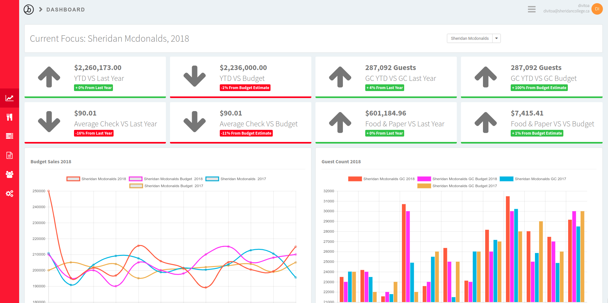

import Img from "gatsby-image";

## Role
- Project Manager
- Lead Programmer
- Designer

## Project Timeline
- 1 Year

## Team Size
- 4 People

# Overview
During my last year at Sheridan College while in Software Development and Network
Engineering demploma program, I had to complete a capstone with 4 teammates to
summarize and show off what we learnt over the 3 year's while in the program.
We were able to ether choose a client from a list and hope we land the one we
wanted or create our own project. My teammates and I decided we would want to try
and land the biggest project on the client list. We landed it. The problem was that
an Owner of 12 McDonald's stores wanted a solution to track his expenses closer and 
get ride of his old workflow of using spreadsheets. We came up with budgetise to
solve his problem.

# Contributions
- Created the entire design of the site and landing page
- Created initial design of the project and Git workflow
- Added User registration and security features
- Helped teammates become knowledgeable about tools and packages project used
- Presented and showcased at sheridan's capstone competition
- Helped with presentations

# Purpose
Initially the owner was managing his stores expenses using excel spreadsheets but
as he started to acquire more he noticed that there would be multiple spreadsheets
floating around his upper management. These spreadsheets were huge with over 25
sections to them that only kept a year of data. Versioning the spreadsheets was 
difficult to manage as well because it was hard to tell who had the most recent copy.
There was a lot of corrections needed because of mis-input so the sheets always
needed to be double checked because of inconsistences that sometimes arouse. Statistical
gathering was another big issue, there was no easy way to collect all of the stores
historic data to try and discover deeper trends in the data.

# Solution
In an effort to help the store owner manage his stores better we decided to create
a website that mimicked his excel worksheet workflow but with extra features.
My team and I decided to add all the features that the excel work sheet's lacked
as well as a fine grain security policy features. The hope was to only give
upper management the data they only needed to run they're stores and give the
owner of all the stores full access to the website. We also created a dashboard
that was able to quickly give store owners a run down of how they're
store was preforming that month. We created smaller modules to track different types
of business expenses such as tracking contractors or other irregular type fee's. 

# Technology
Initially we started with using Angular 2+ on the frontend and .Net Core 2 on the
backend. I thought .Net Core 2 was amazing and C# as a language is so much fun to
program in. Some of our teammates however were more experienced with javascript so
I decided to change the backend to my own implementation or NestJS (because I didn't
know that NestJS existed until it was too late into the project). We decided to 
use postgres as our database and we deployed all of this to a server hosted on
Digital Ocean.

# Reflection

Overall the team is of the opinion that we have made significant progress during
each sprint, and consistently delivered on each week’s goals to the best each
team member’s abilities. Coming into our final term, team members were at very 
different skill levels with our core tech stack. Confronted with this challenge,
individuals with more expertise took the time and effort to bring other members
up to speed and reach reasonable productivity levels.

The team started off the semester moving at a slow pace, but each week, the
quality, volume and velocity for which we ship new features and improvements has
improved drastically. The ability of each team member to estimate delivery times
has also progressed nicely.

Our group has done a decent job of communicating this semester,but it can be
improved. We recognize it can be hard to ask for help or admit a task is above your
bandwidth. Software development and business are team sports, knowing this we
need to be better at asking for an assist when needed.

Our client is delighted with how the project is progressing. This knowledge will
fuel us to work hard towards delivering an amazing product.  The ultimate goal is
to exceed our first client’s expectations, with an eye on future clients.

